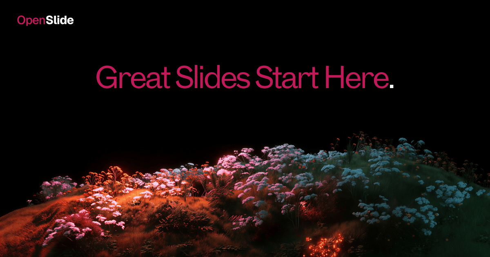

<div align="center">
  
  
  <br />
  <br />

  <p>
    <a href="https://tryopenslide.com"><strong>tryopenslide.com</strong></a> ·
    <a href="#-quick-start">Quick Start</a> ·
    <a href="#-self-hosting">Self-Hosting</a> ·
    <a href="#-contributing">Contributing</a>
  </p>

  <p>
    
    
    
    
    
  </p>

  <br />

  <h3>AI-powered presentations and documents.<br />Describe what you need. Watch it build.</h3>

  <br />
</div>

---

## What is OpenSlide?

OpenSlide is an AI agent for creating presentations and documents. You describe what you want in a chat interface — the agent builds polished slides in real time using tool calls. It connects to your tools (Google Drive, GitHub, and more) so it can work with your actual data, not just what you type.

This is the open-source, self-hostable version. No credits, no paywalls. Just plug in your Anthropic API key and run.

---

## Features

- **Chat-to-slides** — describe a presentation in plain English, get structured slides in seconds
- **Real-time generation** — watch slides build live as the agent works
- **Tool integrations** — connect Google Drive, GitHub, and more via MCP
- **Document builder** — generate business documents, not just slide decks
- **Deep research mode** — multi-agent research that pulls from the web before building
- **Brand Kit** — upload your brand guidelines, apply them to every deck
- **PDF & PPTX export** — pixel-perfect exports via Puppeteer
- **Themes** — minimal, dark pro, academic, bold
- **Public sharing** — share any presentation with a link
- **Fully self-hostable** — your data, your infra, your API key

---

## Stack

| Layer | Technology |
|---|---|
| Framework | Next.js 15 (App Router) + TypeScript |
| Auth | Supabase Auth (email + Google OAuth) |
| Database | PostgreSQL via Supabase + Prisma ORM |
| Cache | Upstash Redis (session cache, 1hr TTL) |
| AI | Anthropic Claude (claude-sonnet-4-6) |
| Export | Puppeteer + pdf-lib (PDF), pptxgenjs (PPTX) |
| Animations | Framer Motion |
| Styling | Tailwind CSS + CSS custom properties |

---

## Quick Start

```bash
git clone https://github.com/archits01/OpenSlide.git
cd OpenSlide
npm install
cp .env.example .env.local
npm run dev
```

Open [http://localhost:3000](http://localhost:3000). Fill in your env vars first — see below.

---

## Self-Hosting

### Prerequisites

- Node.js 18+
- [Supabase](https://supabase.com) project (free tier works)
- [Upstash Redis](https://upstash.com) database (free tier works)
- [Anthropic API key](https://console.anthropic.com)

### 1. Environment Variables

```bash
cp .env.example .env.local
```

Minimum required:

```env
ANTHROPIC_API_KEY=sk-ant-...
NEXT_PUBLIC_SUPABASE_URL=https://your-project.supabase.co
NEXT_PUBLIC_SUPABASE_ANON_KEY=your_anon_key
DATABASE_URL=postgresql://...
DIRECT_URL=postgresql://...
UPSTASH_REDIS_REST_URL=https://...
UPSTASH_REDIS_REST_TOKEN=...
```

See [`.env.example`](.env.example) for all options.

### 2. Database

```bash
npx prisma migrate deploy
npx prisma generate
```

### 3. Supabase Auth Trigger

Run this once in your Supabase SQL editor — it creates a `public.users` row whenever someone signs up:

```sql
create or replace function public.handle_new_user()
returns trigger as $$
begin
  insert into public.users (id, email, full_name, avatar_url)
  values (
    new.id,
    new.email,
    new.raw_user_meta_data->>'full_name',
    new.raw_user_meta_data->>'avatar_url'
  )
  on conflict (id) do nothing;
  return new;
end;
$$ language plpgsql security definer;

create or replace trigger on_auth_user_created
  after insert on auth.users
  for each row execute procedure public.handle_new_user();
```

### 4. Run

```bash
npm run dev
```

---

## PDF & PPTX Export (Optional)

Export is handled by a separate Node.js server using Puppeteer — Vercel can't run Chromium.

**Run locally:**
```bash
cd pdf-server
npm install
node server.js
```

Then add to `.env.local`:
```env
PDF_SERVER_URL=http://localhost:3001
PDF_SERVER_SECRET=any_secret_you_choose
```

**On a VPS:**
```bash
scp -r pdf-server/ root@your-vps:/opt/openslide-pdf
ssh root@your-vps "cd /opt/openslide-pdf && bash setup.sh"
```

---

## Tool Integrations (MCP)

OpenSlide supports external tool connections via the Model Context Protocol. Set `MCP_SERVER_URL` in your env to activate Google Drive, GitHub, and other integrations.

---

## Deploy to Vercel

```bash
npm run build   # verify locally first
vercel --prod
```

Set all env vars in the Vercel dashboard. The chat route is already configured with `maxDuration = 300` for long generations.

---

## Project Structure

```
src/
├── app/              # Next.js pages + API routes
├── agent/            # Agent loop, tools, MCP, streaming
├── components/       # UI — editor, layout, shared
├── lib/              # DB, Redis, Supabase, utilities
├── skills/           # Presentation & document skill definitions
└── styles/           # Design tokens (CSS custom properties)

pdf-server/           # Standalone Puppeteer export server
prisma/               # Schema + migrations
```

---

## Contributing

PRs are welcome. For larger changes, open an issue first so we can align on direction.

1. Fork the repo
2. Create a branch (`git checkout -b feature/your-feature`)
3. Commit your changes
4. Open a pull request

---

## License

AGPL v3 — see [LICENSE](LICENSE) for details.

Any use of this code in a public-facing product or service requires you to open source your full codebase under the same license.

---

<div align="center">
  <br />
  <p>Built by <a href="https://github.com/archits01">Archit</a> and Saksham</p>
  <p>Part of <a href="https://tryopenslide.com"><strong>Open Computer</strong></a></p>
  <br />
</div>
